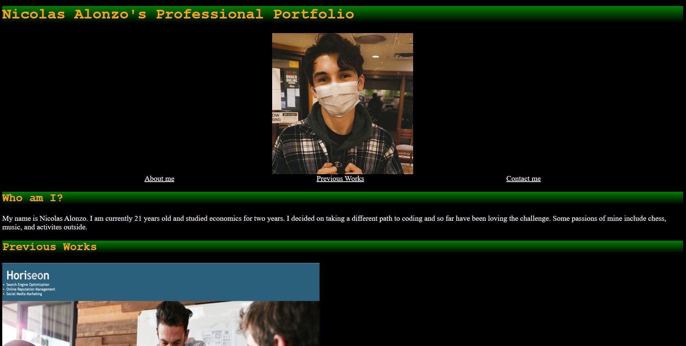
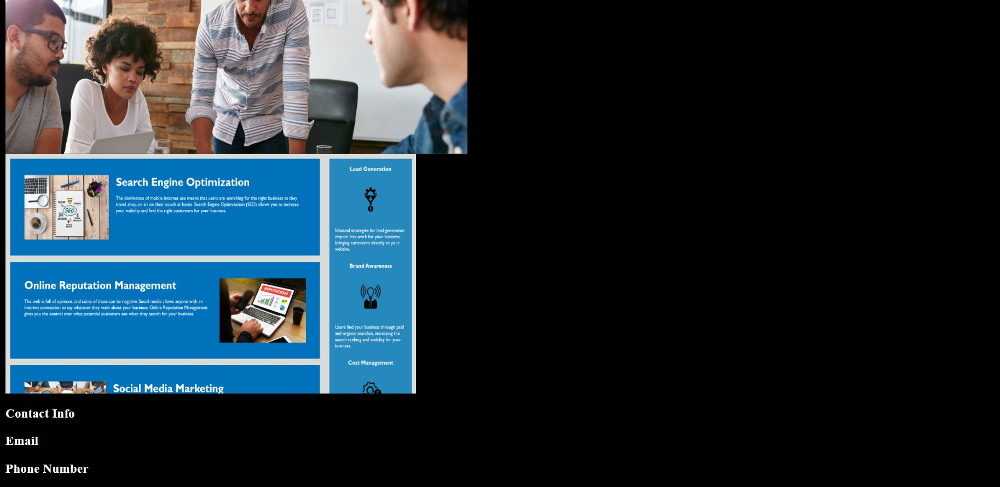

This is my Read me file for the Professional portfolio assignment.

# The Assignment
We were expected to use the html skills and css skills we have been working on to make a start on our own professional portfolio.

# Expectations
GIVEN I need to sample a potential employee's previous work
WHEN I load their portfolio
THEN I am presented with the developer's name, a recent photo or avatar, and links to sections about them, their work, and how to contact them
WHEN I click one of the links in the navigation
THEN the UI scrolls to the corresponding section
WHEN I click on the link to the section about their work
THEN the UI scrolls to a section with titled images of the developer's applications
WHEN I am presented with the developer's first application
THEN that application's image should be larger in size than the others
WHEN I click on the images of the applications
THEN I am taken to that deployed application
WHEN I resize the page or view the site on various screens and devices
THEN I am presented with a responsive layout that adapts to my viewport

# Notes
1. My Name, a photo or avatar of me, links to sections about them, their work and how to contact
2. Have a nav bar that connects them to a corresponding section
3. When viewer clicks link to section about my work the UI scrolls to a section with titled images of the developer's application
4. The first application should be larger in size than the others
5. When clicking on image of application you are taken to deployed appication
6. When resizing the page or view on various screens the layout adapts to their view port.

